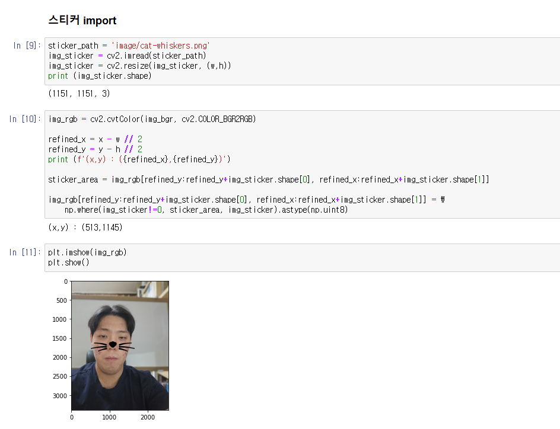
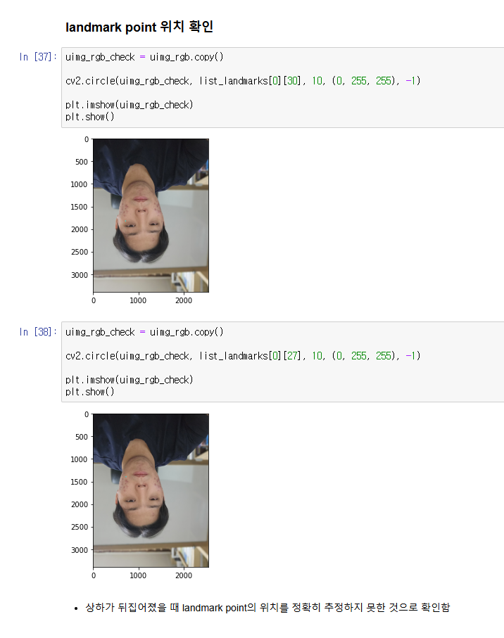

# AIFFEL Campus Online Code Peer Review Templete
- 코더 : 윤수영
- 리뷰어 : 김영민


# PRT(Peer Review Template)
- [x]  **1. 주어진 문제를 해결하는 완성된 코드가 제출되었나요?**
    - 문제에서 요구하는 최종 결과물이 첨부되었는지 확인
        - 중요! 해당 조건을 만족하는 부분을 캡쳐해 근거로 첨부
        
        - 이미지에 스티커가 잘 붙어 있습니다.
        - ```
        img_rgb = cv2.cvtColor(img_bgr, cv2.COLOR_BGR2RGB)

refined_x = x - w // 2
refined_y = y - h // 2
print (f'(x,y) : ({refined_x},{refined_y})')

sticker_area = img_rgb[refined_y:refined_y+img_sticker.shape[0], refined_x:refined_x+img_sticker.shape[1]]

img_rgb[refined_y:refined_y+img_sticker.shape[0], refined_x:refined_x+img_sticker.shape[1]] = \
    np.where(img_sticker!=0, sticker_area, img_sticker).astype(np.uint8)
        ```
    
- [x]  **2. 전체 코드에서 가장 핵심적이거나 가장 복잡하고 이해하기 어려운 부분에 작성된 
주석 또는 doc string을 보고 해당 코드가 잘 이해되었나요?**
    - 해당 코드 블럭을 왜 핵심적이라고 생각하는지 확인
    - 해당 코드 블럭에 doc string/annotation이 달려 있는지 확인
    - 해당 코드의 기능, 존재 이유, 작동 원리 등을 기술했는지 확인
    - 주석을 보고 코드 이해가 잘 되었는지 확인
        - 중요! 잘 작성되었다고 생각되는 부분을 캡쳐해 근거로 첨부
        
        - 기울어진 사진에 대한 부분이 잘 작동되었다고 생각했고 이미지 회전시에 나타나는 검정 배경도 잘 처리되었습니다.
        - ```
        M = cv2.getRotationMatrix2D((cx, cy), -rotation_rate_rimg, 1.0)
rotated_image = cv2.warpAffine(img_sticker, M, (w, h), borderValue=(255,255,255))

print(rotated_image.shape)
plt.imshow(rotated_image)
plt.show()
        ```
        
- [x]  **3. 에러가 난 부분을 디버깅하여 문제를 해결한 기록을 남겼거나
새로운 시도 또는 추가 실험을 수행해봤나요?**
    - 문제 원인 및 해결 과정을 잘 기록하였는지 확인
    - 프로젝트 평가 기준에 더해 추가적으로 수행한 나만의 시도, 
    실험이 기록되어 있는지 확인
        - 중요! 잘 작성되었다고 생각되는 부분을 캡쳐해 근거로 첨부
        
        - 흑백사진에 스티커를 붙이는 부분에서 에러가 발생했었고 그걸 기록하고 디버깅한 결과를 마크다운으로 남겼습니다.
        
- [x]  **4. 회고를 잘 작성했나요?**
    - 주어진 문제를 해결하는 완성된 코드 내지 프로젝트 결과물에 대해
    배운점과 아쉬운점, 느낀점 등이 기록되어 있는지 확인
    - 전체 코드 실행 플로우를 그래프로 그려서 이해를 돕고 있는지 확인
        - 중요! 잘 작성되었다고 생각되는 부분을 캡쳐해 근거로 첨부
        
        - 회고를 통해 어떤 문제가 발생했었는지, 또 어떻게 해결했는지 또는 해결할 것인지 자세하게 기록되었고 추가적으로 실험할 부분도 기록되어 있습니다.
        
- [x]  **5. 코드가 간결하고 효율적인가요?**
    - 파이썬 스타일 가이드 (PEP8) 를 준수하였는지 확인
    - 코드 중복을 최소화하고 범용적으로 사용할 수 있도록 함수화/모듈화했는지 확인
        - 중요! 잘 작성되었다고 생각되는 부분을 캡쳐해 근거로 첨부
        
        
        - 이미지를 회전하고 거꾸로 뒤집어가면서 실험한 장면이 간결하게 끊어저서 가독성이 좋았고 실험과정이 한눈에 보였습니다.
        - 스티커를 회전했을때 검정색 배경 여백이 발생하는 과정을 잘 지켜볼 수 있게 플롯이 다 작성되어 있고 어떤 문장을 통해 이를 해결 했는지 명쾌하게 적혀있습니다.
        - ```
        #landmark에 사용할 이미지 복사
uimg_rgb_land = uimg_rgb.copy()

list_landmarks = []

#landmark 좌표점을 추출하여 list에 저장
for dlib_rect in dlib_rects:
    points = landmark_predictor(uimg_rgb, dlib_rect)
    list_points = list(map(lambda p: (p.x, p.y), points.parts()))
    list_landmarks.append(list_points)

#저장된 좌표점을 실제 사진에 점으로 append
for landmark in list_landmarks:
    for point in landmark:
        cv2.circle(uimg_rgb_land, point, 10, (0, 255, 255), -1)
        
plt.imshow(uimg_rgb_land)
plt.show()

        uimg_rgb_check = uimg_rgb.copy()

cv2.circle(uimg_rgb_check, list_landmarks[0][27], 10, (0, 255, 255), -1)
        
plt.imshow(uimg_rgb_check)
plt.show()
        ```


# 회고(참고 링크 및 코드 개선)
```
# 리뷰어의 회고를 작성합니다.
# 코드 리뷰 시 참고한 링크가 있다면 링크와 간략한 설명을 첨부합니다.
# 코드 리뷰를 통해 개선한 코드가 있다면 코드와 간략한 설명을 첨부합니다.
```
